### `zia@github ~ $ ./contributions.sh`

  

### `zia@github ~ $ whoami`

<table>
<tr>
<td valign="top"></td>
<td valign="top"></td>
</tr>
</table>

### `zia@github ~ $ ./links.sh`

[Portfolio](https://www.ziaabdullah.com/) · [X / Twitter](https://x.com/ZiaAbdullah14)

Full-Stack Developer · Technical SEO Specialist

<!-- Maintenance: the contribution calendar refreshes daily through GitHub Actions.
To update the portrait/card: install Pillow and run python scripts/build_profile.py.
Design inspired by https://github.com/AVIVASHISHTA29/AVIVASHISHTA29. -->
